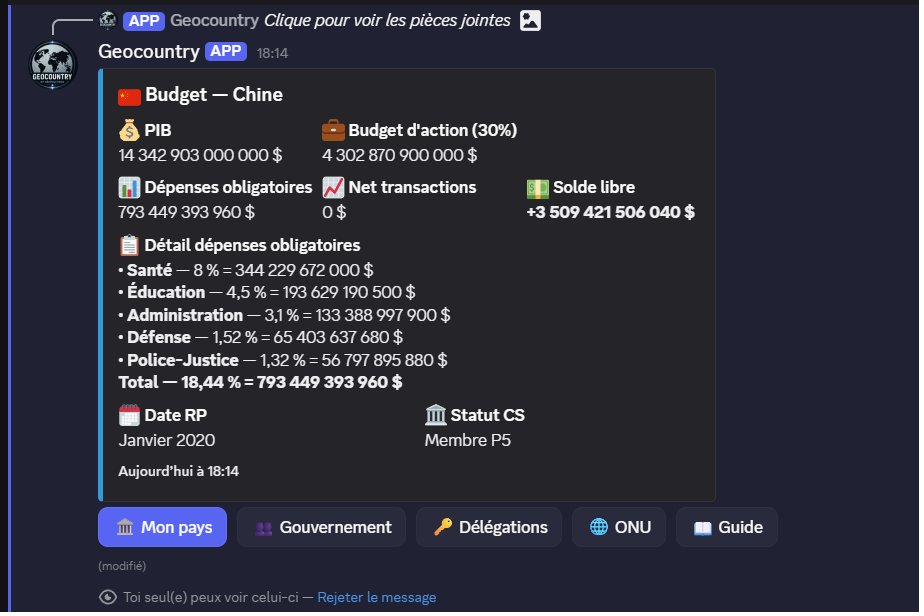

# GeoCountry

Simulation géopolitique en temps réel sur Discord : une centaine de pays, une économie nationale, un Conseil de Sécurité de l'ONU. Bot déployé en continu, 24/7.

C'est mon projet principal, et il tourne **en production** — pas une démo. Les joueurs incarnent un pays, gèrent son économie, siègent au Conseil de Sécurité de l'ONU et votent des résolutions. Le bot encaisse de vrais utilisateurs, de vraies données, et les contraintes qui vont avec : disponibilité, cohérence, sécurité.

Présentation détaillée : **[gadzyo.dev/geocountry](https://gadzyo.dev/geocountry.html)**

---

## Aperçu

Budget national généré en direct par le bot : PIB, dépenses obligatoires, solde, statut au Conseil de Sécurité.

## Fonctionnalités

- Économie nationale : PIB, budgets, dépenses obligatoires et soldes en temps réel
- Conseil de Sécurité de l'ONU : sièges, statuts P5, dépôt et vote de résolutions
- Diplomatie et délégations entre pays
- Calendrier de jeu automatique
- Tableau de bord par pays (embeds + boutons)
- Sécurité anti-raid et gestion des permissions
- Environ 100 commandes

## Architecture

J'ai séparé le projet en trois couches pour qu'il reste maintenable à mesure qu'il grossit :

| Couche | Rôle |
|---|---|
| Présentation | Commandes Discord, embeds, boutons |
| Service | Logique de jeu : économie, votes, résolutions, calendrier |
| Données | SQLite, avec migrations de schéma appliquées en production sans coupure |

## Stack

Python · discord.py · SQLite · Linux/systemd · VPS · Git

## Quelques problèmes que j'ai dû résoudre

- **Concurrence sur les votes.** Des votes simultanés au Conseil créaient des incohérences. Le bug ne sortait que sous charge réelle ; je l'ai isolé, compris, puis corrigé.
- **Migrations sans coupure.** Faire évoluer le schéma de la base pendant que le bot tourne 24/7, sans perdre de données.
- **Anti-raid.** Protéger le serveur et les données avec une gestion fine des permissions, en défense en profondeur.
- **Livrer proprement.** Le module « Cockpit » découpé et livré en une session : 10 commits, une intention par commit.

## État

v0.12.0, en production, stable. Roadmap V1 : 8 chantiers planifiés.

## Pourquoi le code n'est pas entièrement ici

Ce dépôt est une vitrine. Le code source complet reste privé (jetons, logique anti-raid, données de jeu). J'y présente l'architecture et la démarche.

## Moi

Gadzyo — dev, systèmes & sécurité.
[gadzyo.dev](https://gadzyo.dev) · gadzyo@gadzyo.dev
